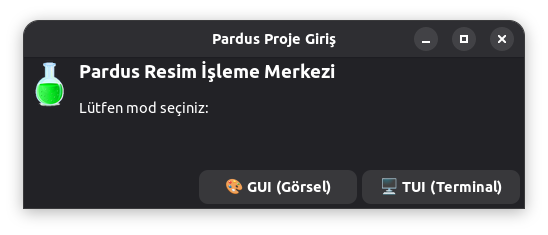
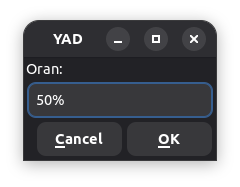
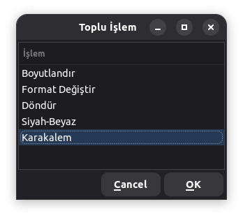
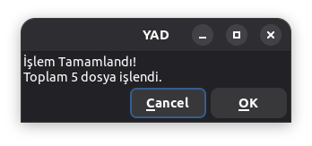
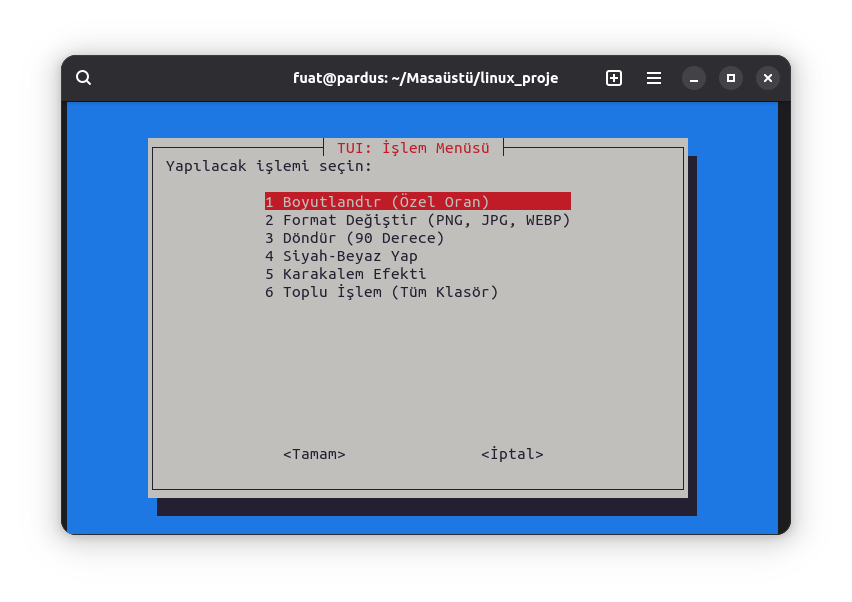
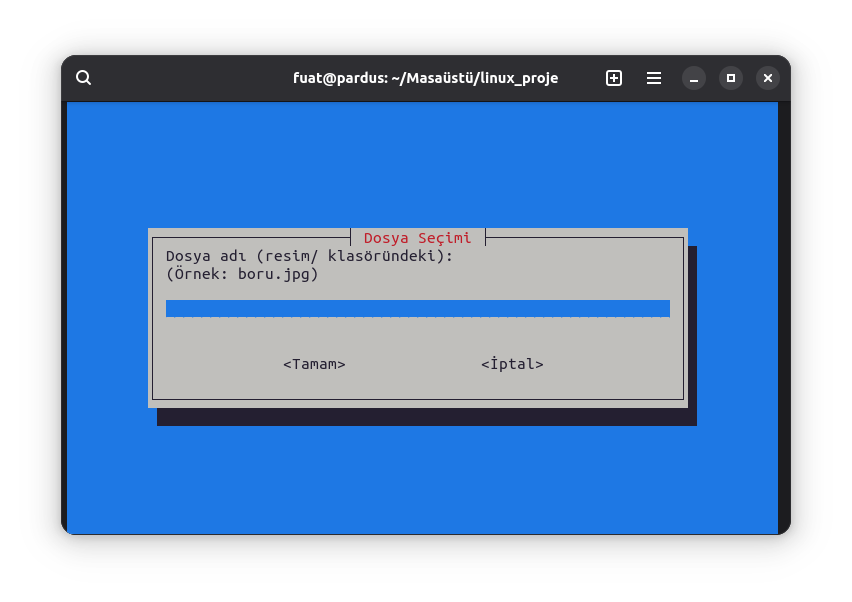
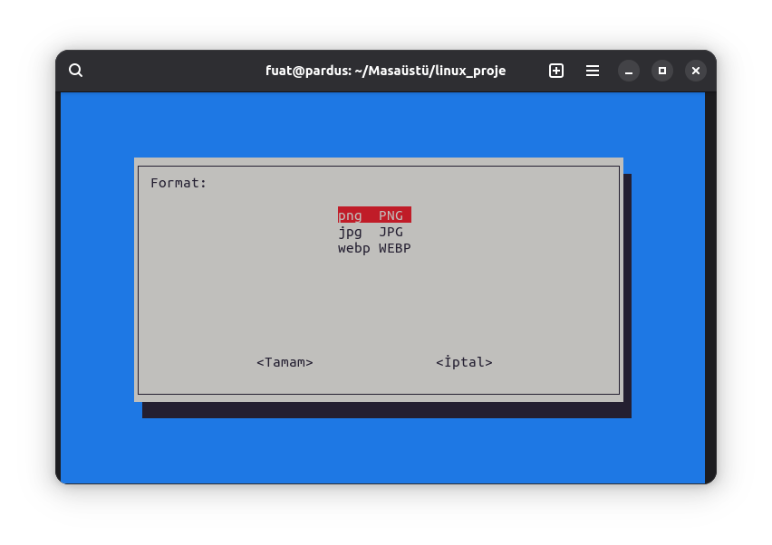
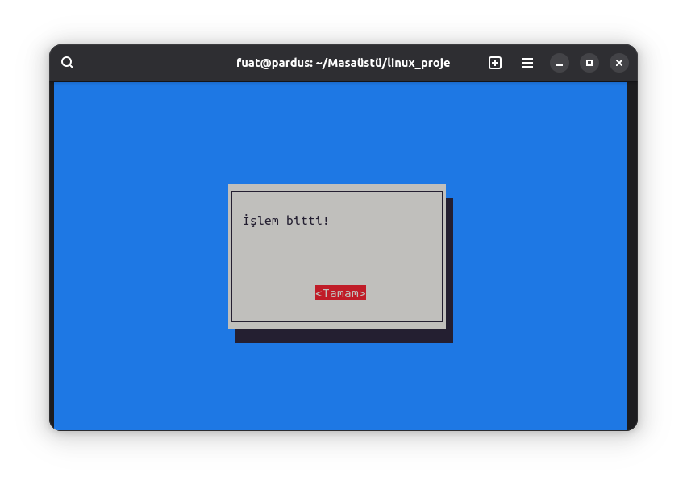

#  Pardus Resim İşleme Merkezi

Linux Araçları ve Kabuk Programlama dersi kapsamında geliştirilmiş bu proje, **ImageMagick** komut satırı aracını temel alarak,
kullanıcıların resim işleme işlemlerini **Grafiksel Kullanıcı Arayüzü (GUI)** ve
**Terminal Tabanlı Kullanıcı Arayüzü (TUI)** üzerinden kolayca yapabilmesini amaçlamaktadır.

Proje **PARDUS Linux** üzerinde test edilmiş ve sorunsuz şekilde çalışmaktadır.

---

## Projenin Amacı

Bu projenin temel amacı:

- Linux komut satırı araçları için **kullanıcı dostu arayüzler geliştirmek**
- **Bash (Shell Script)** kullanarak GUI ve TUI uygulamaları oluşturmak
- **ImageMagick** aracının temel resim işleme özelliklerini görsel hale getirmek
- PARDUS Linux uyumluluğunu sağlamak

---

##  Kullanılan Teknolojiler

- **Programlama Dili:** Bash (Shell Script)
- **GUI:** YAD (Yet Another Dialog)
- **TUI:** Whiptail
- **Resim İşleme:** ImageMagick
- **İşletim Sistemi:** PARDUS Linux

---

##  Uygulama Özellikleri

### 🔹 Tekli Resim İşlemleri
- Resim bilgilerini görüntüleme
- Boyutlandırma (yüzdelik oran ile)
- Format dönüştürme (PNG, JPG, WEBP)
- Döndürme (90 derece)
- Siyah-Beyaz dönüştürme
- Karakalem efekti

### 🔹 Toplu İşlemler
- Belirlenen klasördeki tüm resimlere:
  - Boyutlandırma
  - Format dönüştürme
  - Döndürme
  - Siyah-beyaz
  - Karakalem efekti uygulama

---

## GUI (Grafiksel Arayüz) Kullanımı

GUI arayüzü **YAD (Yet Another Dialog)** kullanılarak geliştirilmiştir.
Kullanıcılar grafiksel menüler aracılığıyla işlemlerini kolayca gerçekleştirebilir.

### GUI Ekran Görüntüleri

#### 🔹 Ana Menü
Uygulamanın açılış ekranıdır. Kullanıcı yapılacak işlemi buradan seçer.



---

#### 🔹 Boyutlandırma Oranı Girişi
Seçilen resim için yüzdelik boyutlandırma oranı bu ekranda girilir.



---

#### 🔹 Toplu İşlem Menüsü
Belirlenen klasördeki tüm resimlere aynı işlemin uygulanmasını sağlar.



---

#### 🔹 İşlem Başarılı Bildirimi
Resim işleme tamamlandığında kullanıcıya bilgilendirme mesajı gösterilir.



---

##  TUI (Terminal Tabanlı Arayüz) Kullanımı

TUI arayüzü **Whiptail** kullanılarak geliştirilmiştir.
Grafik arayüze göre daha sade bir yapıya sahiptir ancak temel tüm işlevleri destekler.

###  TUI Ekran Görüntüleri

#### 🔹 Ana Menü
Uygulamanın açılış ekranıdır. Kullanıcı yapılacak işlemi buradan seçer.


---

#### 🔹 TUI Ana Menü
Terminal üzerinden yapılacak işlemin seçildiği ana menüdür.



---

#### 🔹 Dosya Adı Girişi
Kullanıcı işlem yapılacak resmin adını bu ekranda girer.



---

#### 🔹 Format Seçim Menüsü
Resmin dönüştürüleceği hedef format bu ekrandan seçilir.



---

#### 🔹 İşlem Tamamlandı Mesajı
İşlem başarıyla tamamlandığında kullanıcı bilgilendirilir.



---

##  Kurulum ve Çalıştırma

###  Gerekli Bağımlılıklar

```bash
sudo apt update
sudo apt install imagemagick yad whiptail -y
```
---
### Projeyi İndirme
```
git clone https://github.com/fuatuzm/linux-proje.git
cd linux-proje
```

### Çalıştırma

```
chmod +x resim_isleme.sh
./resim_isleme.sh

```
---

#### Toplu işlemler için resimler şu klasörde bulunmalıdır:

~/Masaüstü/linux_proje/resim/

---

## Tanıtım Videosu


### YouTube Tanıtım Videosu:
* https://www.youtube.com/watch?v=mV1cZ6OAeEE

* Kurulum adımları

* GUI ve TUI kullanımı

* Tekli ve toplu işlemler

* Canlı demo ve sesli anlatım yer almaktadır

---

## Proje Dizin Yapısı

```
linux_proje/
├── resim/
├── ekran_goruntuleri/
├── resim_isleme.sh
└── README.md

```
---

## Pardus Uyumluluğu

* Proje PARDUS Linux üzerinde test edilmiştir

* Gerekli tüm bağımlılıklar resmi depolardan kurulabilmektedir

* Bash standartlarına uygun olarak geliştirilmiştir


